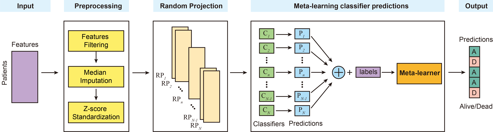

# MetaAMI: A Novel <ins>Meta</ins>-Learning Approach for Predicting In-Hospital Mortality in <ins>A</ins>cute <ins>M</ins>yocardial <ins>I</ins>nfarction

**MetaAMI** (A Novel Meta-Learning Approach for Predicting In-Hospital Mortality in Acute Myocardial Infarction)is an accurate and cost-effective meta-learning model for predicting in-hospital mortality in acute myocardial infarction patients using routinely collected clinical features. By combining random projection with stacked ensemble learning and an SVM meta-learner, **MetaAMI** provides reliable risk prediction and supports clinical decision-making for early mortality risk stratification.

## Flowchart of MetaAMI


## Table of Contents
- [Installation](#installation)
- [Tutorials](#Tutorials)
- [Bug Report](#Bug-Report)
- [Authors](#Authors)
- [Publication](#Publication)
## Installation
1. Clone the MetaAMI git repository
```bash
git clone https://github.com/wan-mlab/MetaAMI.git
```
2. Navigate to the directory of MetaAMI package
```bash
cd /your path/MetaAMI
pip install .
```
## Tutorials
how to use the method
```bash
from MetaAMI import MetaAMIConfig, run_metaami

cfg = MetaAMIConfig(
    data_path="data/feature.csv",
    label_path="data/label.csv",
    output_dir="results/metaami_run",
    id_col="hadm_id",
    label_col="label",
    rp_dim=10,  #random projection dimention
    n_rp=10,  #number of random projection
    n_splits=10,
    n_repeats=1, #repeat times of random projection
    models=("lr", "svm", "rf", "xgb", "mlp", "ae_mlp", "ot_mlp", "transformer"),
    meta_model="svm_rbf",
    threshold=0.5,
    threshold_strategy="youden",
)

run_metaami(cfg)
```
## Bug Report

If you find any bugs or problems, or you have any comments on MetaAMI, please don't hesitate to contact via email btuerhanbayi@unmc.edu or [Issues](https://github.com/wan-mlab/MetaAMI/issues).

## Authors
Bulidierxin Tuerhanbayi, Shibiao Wan

## Publication

## License 
